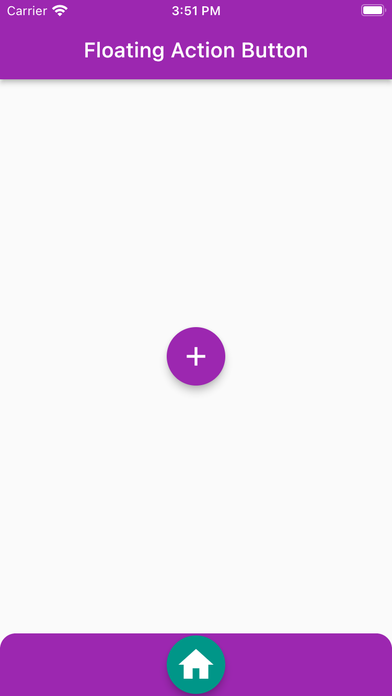
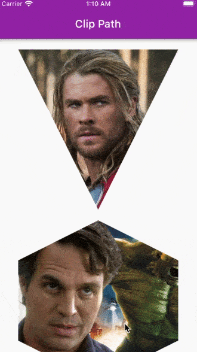

# Widget of The Day

</img>
Introduction to flutter widgets: This repo will teach you some of the common widgets that are available in flutter SDK, & shows you how to use them for your UI design. 
Playlist URL:

1. [YouTube](https://www.youtube.com/watch?v=X47zIAGIJNE&list=PLlvRDpXh1Se5LTJZDrUF9h1_1AT4Raxjd)
2. [YouTube](https://www.youtube.com/watch?v=FZiw9MWLlys) [LinearGradient]
3. [YouTube](https://www.youtube.com/watch?v=pDnfJvh7uzc) [Card]
4. [YouTube](https://www.youtube.com/watch?v=8QdLBQhnHAQ&t=457s)[Clipper]
5. [YouTube](https://www.youtube.com/watch?v=1ToqYMSnNhA)[CustomPaint]
6. [YouTube](https://www.youtube.com/watch?v=n2Dav9ONJsY)[DataTable]
7. [YouTube](https://www.youtube.com/watch?v=GsmP-NzXXa0)[Hero_Animation]
8. [YouTube](https://www.youtube.com/watch?v=M9J-JJOuyE0)[Stepper_To_SelectableText]

## Widgets List:

1. [Container](/lib/1_container/container.dart) > Simple intro > Neumorphic design
2. [Expanded](/lib/2_expanded/expanded.dart) > flux > layout change inside Column & Row
3. [Column](/lib/3_column&row/column.dart) > mainAxisAlignment & crossAxisAlignment 
   [Row](/lib/3_column&row/row.dart) > alignment
4. [ListView](/lib/4_listview&builder/listview.dart) > Builder > Instagram UI design
5. [SingleChildScrollView](/lib/5_single_child_scroll_view/single_child_scroll_view.dart) > scrollDirection > padding > physics
6. [Image.Asset](/lib/6_image.asset/image_asset.dart) > fit (BoxFit.cover) > place it inside a Container widget for rounded corners
7. [Gridview](/lib/7_gridview&builder/gridview.dart) > Builder > crossAxisCount (no. of box in the horizontal)
8. [GestureDetector](/lib/8_gesturedetector/gesturedetector.dart) > onTap:()=>{'action'} > Keep functional logic seperated from UI
9. [BottomNavBar](/lib/9_bottom-nav_bar/bottomnavbar.dart) > StateStatefulWidget > type: BottomNavigationBarType.fixed > List of pages
10. [AppBar](/lib/10_appbar/appbar.dart) > backgroundColor: Colors.transparent > leading (left positioned)> actions (right positioned)
11. [Drawer](/lib/11_drawer/drawer.dart) > Always in ListView > DrawerHeader > ListTile > endDrawer (drawer on right side)
12. [SliverAppBar](/lib/12_sliver-appbar/sliverappbar.dart) > CustomScrollView > SliverAppBar > expandedHeight > SliverToBoxAdapter  
    Property of SliverAppBar: flexibleSpace > floating (default 'false') > pinned (default 'false')
13. [TabBar](/lib/13_tabbar/tabbar.dart) > wrap Scaffold with 'DefaultTabController' > length (no. of items) > TabBar  
    TabBarView > Container > wrap TabBarView with 'Expanded' for Container size
14. [AnimatedContainer](/lib/14_animated-container/animatedcontainer.dart) > GestureDetector > onTap (activate animation) > duration (time to execute animation in 'second') > Container > Alignment
15. [MediaQuery](/lib/15_media_query/mediaquery.dart) > Height > Width > Aspect Ratio > Orientation
16. [AlertDialog](/lib/16_alert_dialog/alertdialog.dart) > MaterialButton > onPressed:\_showDialog > AlertDialog(title, content, actions) > CupertinoAlertDialog (for iOS device)
17. [Text](/lib/17_text&styling/text_n_styling.dart) > style > TextStyle > fontStyle: FontStyle.italic > fontWeight > theme (for setting a default style)
18. [RichText](/lib/18_rich_text/richtext.dart) > TextSpan > default style > children > multiple 'TextSpan' widgets
19. [Timer](/lib/19_timer/timer.dart) > StatefulWidget > Text > MaterialButton > onPressed: \_startCountDown > Timer.periodic
20. [PageView](/lib/20_pageview/pageview.dart) > controller > scrollDirection: Axis.vertical > different Post pages
21. [Stack](/lib/21_stack/stack.dart) > alignment: Alignment.center (default Alignment.topLeft)
22. [TextField](/lib/22_textfield/textfield.dart) > StatefulWidget > \_textController > TextField > controller: \_textController > decoration > onPressed > suffixIcon > \_textController.clear() > Expanded > userPost
23. [AnimatedIcon](/lib/23_animated_icon/animated_icon.dart) > StatefulWidget > with SingleTickerProviderStateMixin > late AnimationController \_animationController > Read the code
24. [Slider](/lib/24_slider/slider.dart) > StatefulWidget > Slider(value: value, onChanged: onChanged) > Many color parapeter of the Slider widget
25. [DatePicker](/lib/25_date_picker/date_picker.dart) > StatefulWidget > DateTime variable > \_showDatePicker > Read the code
26. [TimePicker](/lib/26_time_picker/time_picker.dart) > StatefulWidget > TimeOfDay variable > \_showTimePicker > Read the code
27. [ListWheelScrollView](/lib/27_listwheelscrollview/listwheelscrollview.dart) > StatefulWidget > itemExtent > perspective > diameterRatio > physics: const FixedExtentScrollPhysics() > onSelectedItemChanged > Read the code
28. [LinearGradient](/lib/28_lineargradient/lineargradient.dart) > Container > decoration > BoxDecoration > gradient > LinearGradient
29. [ElevatedButton](/lib/29_elevated_button/elevated_button.dart) > style > ElevatedButton.styleFrom > primary: Colors.blue  
    [OutlinedButton](/lib/29_elevated_button/elevated_button.dart)
30. [FloatingActionButton](/lib/30_floating_action_button/floating_action_button.dart)
31. [RawMaterialButton](/lib/31_raw_material_button/raw_material_button.dart) > Use for custom fancy button
32. [IconButton](/lib/32_icon_button/iconbutton.dart)
33. [Navigator](/lib/33_navigator/navigator.dart) > initialRoute > ElevatedButton > Navigator.pushNamed(context, '/first') > Navigator.pop(context)
34. [Card](/lib/34_card/card.dart) > shape: RoundedRectangleBorder > borderRadius: BorderRadius.circular(20) > Column > children[] > shadowColor > elevation
35. [Clipper](/lib/35_clipper/clipper.dart) > Custom Clipper > Quadratic Bezier Curve
36. [RotatedBox](/lib/36_rotated_box/rotated_box.dart) > quarterTurns: 3 > Each quarterTurns is ≡ 90°
37. [Transform](/lib/37_transform/transform.dart) > origin > transform
38. [Positioned](/lib/38_positioned/positioned.dart) > Stack > alignment > Positioned > 2 properties at a time
39. [CustomPaint](/lib/39_custom_paint/custom_paint.dart) > Watch the video
40. [ClipOval](/lib/40_clipoval/clipoval.dart) > Image.asset > height & width should be same > fit: BoxFit.cover
41. [ClipRRect](/lib/41_cliprrect/cliprrect.dart) > borderRadius > Image.asset
42. [ClipRect](/lib/42_cliprect/cliprect.dart) > Image.asset
43. [ClipPath](/lib/43_clippath/clippath.dart) > Image.asset > clipper: > Draw the ClipPath
44. [Radial & Sweep Gradient](/lib/44_radial_gradient/radial_n_sweep_gradient.dart) > Container > decoration > gradient> RadialGradient / SweepGradient
45. [StatefulWidget](/lib/45_stateful_widget/stateful_widget.dart) > createState() > initState() > didChangeDependencies() > didUpdateWidget() > deactivate() > dispose() > setState((){'actions'})
46. [Table](/lib/46_table/table.dart) > border > columnWidths > textDirection > children > TableRow > children
47. [DataTable](/lib/47_data_table/data_table.dart) > border > columnSpacing > onSelectAll > sortColumnIndex > sortAscending > columns > rows
48. [Placeholder](/lib/48_placeholder/placeholder.dart) > fallbackHeight > strokeWidth > color > strokeWidth
49. [GestureDetector & InkWell](/lib/49_gesturedect_&_inkwell/gesturedect_n_inkwell.dart) > GestureDetector > onTap | InkWell > OnTap
50. [Material](/lib/50_material/material.dart) > It can manipulate some properties of it's child widget
51. [Switches](/lib/51_switches/switches.dart) > ListTile > leading > Switch / Checkbox / Radio > value > onChanged > groupValue (only for Radio)
52. [DropDown&Popup](/lib/52_dropdown_&_popupmenu/dropdown_n_popupmenu.dart) > See the code
53. [HeroAnimation](/lib/53_hero_animation/hero_animation.dart) > tag: item in both pages
54. [AboutDialog](/lib/54_aboutdialog/aboutdialog.dart) > ElevatedButton > onPressed > showAboutDialog
55. [Stepper](/lib/55_stepper/stepper.dart) > int \_currentStep = 0 > Stepper > Step (with title: & content:) > onStepTapped > currentStep: \_currentStep > onStepContinue > onStepCancel
56. [FittedBox](/lib/56_fitted_box/fitted_box.dart) > Fit text inside a container
57. [show Search](/lib/57_show_search/show_search.dart) > AppBar > actions > IconButton > onPressed: () {showSearch()}
58. [.adaptive](/lib/58_.adaptive/adaptive.dart) > Slider.adaptive > SwitchListTile.adaptive > Switch.adaptive > Icon(Icons.adaptive.share) > CircularProgressIndicator.adaptive()
59. [StreamBuilder](/lib/59_stream_builder/stream_builder.dart) > StreamBuilder > stream > initialData > builder

## Screenshots:

<table align="center" style="margin: 0px auto;">
  <tr>
    <td>
        

            
            
<a href="/lib/1_container/container.dart" target="_blank">Container</a>

        

    </td>
    <td>
        

            
            
<a href="/lib/2_expanded/expanded.dart" target="_blank">Expanded</a>

        

    </td>
    <td>
        

            
            
<a href="/lib/3_column&row/column.dart" target="_blank">Column</a>

        

    </td>
    <td>
        

            
            
<a href="/lib/3_column&row/row.dart" target="_blank">Row</a>

        

    </td>
    <td>
        

            
            
<a href="/lib/4_listview&builder/listview.dart" target="_blank">ListView & Builder</a>

        

    </td>
  </tr>
  <tr>
  <td>
        

            
            
<a href="/lib/5_single_child_scroll_view/single_child_scroll_view.dart" target="_blank">SingleChildScrollView</a>

        

    </td>
    <td>
        

            
            
<a href="/lib/6_image.asset/image_asset.dart" target="_blank">Image.asset</a>

        

    </td>
    <td>
        

            
            
<a href="/lib/7_gridview&builder/gridview.dart" target="_blank">GridViewBuilder</a>

        

    </td>
    <td>
        

            
            
<a href="/lib/8_gesturedetector/gesturedetector.dart" target="_blank">GestureDetector</a>

        

    </td>
    <td>
        

            
            
<a href="/lib/9_bottom-nav_bar/bottomnavbar.dart" target="_blank">BottomNavBar</a>

        

    </td>
  </tr>
  <tr>
    <td>
        

            
            
<a href="/lib/10_appbar/appbar.dart" target="_blank">AppBar</a>

        

    </td>
    <td>
        

            
            
<a href="/lib/11_drawer/drawer.dart" target="_blank">Drawer</a>

        

    </td>
    <td>
        

            
            
<a href="/lib/12_sliver-appbar/sliverappbar.dart" target="_blank">SliverAppBar</a>

        

    </td>
    <td>
        

            
            
<a href="/lib/13_tabbar/tabbar.dart" target="_blank">TabBar</a>

        

    </td>
    <td>
        

            
            
<a href="/lib/14_animated-container/animatedcontainer.dart" target="_blank">AnimatedContainer</a>

        

    </td>
  </tr>
  <tr>
    <td>
        

            
            
<a href="/lib/15_media_query/mediaquery.dart" target="_blank">MediaQuery</a>

        

    </td>
    <td>
        

            
            
<a href="/lib/16_alert_dialog/alertdialog.dart" target="_blank">AlertDialog</a>

        

    </td>
    <td>
        

            
            
<a href="/lib/17_text&styling/text_n_styling.dart" target="_blank">Text & Styling</a>

        

    </td>
    <td>
        

            
            
<a href="/lib/18_rich_text/richtext.dart" target="_blank">RichText</a>

        

    </td>
    <td>
        

            
            
<a href="/lib/19_timer/timer.dart" target="_blank">Timer</a>

        

    </td>
  </tr>
  <tr>
    <td>
        

            
            
<a href="/lib/20_pageview/pageview.dart" target="_blank">PageView</a>

        

    </td>
    <td>
        

            
            
<a href="/lib/21_stack/stack.dart" target="_blank">Stack</a>

        

    </td>
    <td>
        

            
            
<a href="/lib/22_textfield/textfield.dart" target="_blank">TextField</a>

        

    </td>
    <td>
        

            
            
<a href="/lib/23_animated_icon/animated_icon.dart" target="_blank">Animated Icon</a>

        

    </td>
    <td>
        

            
            
<a href="/lib/24_slider/slider.dart" target="_blank">Slider</a>

        

    </td>
  </tr>
  <tr>
    <td>
        

            
            
<a href="/lib/25_date_picker/date_picker.dart" target="_blank">DatePicker</a>

        

    </td>
    <td>
        

            
            
<a href="/lib/26_time_picker/time_picker.dart" target="_blank">TimePicker</a>

        

    </td>
    <td>
        

            
            
<a href="/lib/27_listwheelscrollview/listwheelscrollview.dart" target="_blank">ListWheelScroll</a>

        

    </td>
    <td>
        

            
            
<a href="/lib/28_lineargradient/lineargradient.dart" target="_blank">LinearGradient</a>

        

    </td>
    <td>
        

            
            
<a href="/lib/29_elevated_button/elevated_button.dart" target="_blank">ElevatedButton</a>

        

    </td>
  </tr>
  <tr>
    <td>
        

            
            
<a href="/lib/30_floating_action_button/floating_action_button.dart" target="_blank">FloatingActionButton</a>

        

    </td>
    <td>
        

            
            
<a href="/lib/31_raw_material_button/raw_material_button.dart" target="_blank">RawMaterialButton</a>

        

    </td>
    <td>
        

            
            
<a href="/lib/32_icon_button/iconbutton.dart" target="_blank">IconButton</a>

        

    </td>
    <td>
        

            
            
<a href="/lib/33_navigator/navigator.dart" target="_blank">Navigator</a>

        

    </td>
    <td>
        

            
            
<a href="/lib/34_card/card.dart" target="_blank">Card</a>

        

    </td>
  </tr>
  <tr>
    <td>
        

            
            
<a href="/lib/35_clipper/clipper.dart" target="_blank">Clipper</a>

        

    </td>
    <td>
        

            
            
<a href="/lib/36_rotated_box/rotated_box.dart" target="_blank">RotatedBox</a>

        

    </td>
    <td>
        

            
            
<a href="/lib/37_transform/transform.dart" target="_blank">Transform</a>

        

    </td>
    <td>
        

            
            
<a href="/lib/38_positioned/positioned.dart" target="_blank">Positioned</a>

        

    </td>
    <td>
        

            
            
<a href="/lib/39_custom_paint/custom_paint.dart" target="_blank">CustomPaint</a>

        

    </td>
  </tr>
  <tr>
    <td>
        

            
            
<a href="/lib/40_clipoval/clipoval.dart" target="_blank">ClipOval</a>

        

    </td>
    <td>
        

            
            
<a href="/lib/41_cliprrect/cliprrect.dart" target="_blank">ClipRRect</a>

        

    </td>
    <td>
        

            
            
<a href="/lib/42_cliprect/cliprect.dart" target="_blank">ClipRect</a>

        

    </td>
    <td>
        

            
            
<a href="/lib/43_clippath/clippath.dart" target="_blank">ClipPath</a>

        

    </td>
    <td>
        

            
            
<a href="/lib/44_radial_gradient/radial_n_sweep_gradient.dart" target="_blank">Radial & Sweep</a>

        

    </td>
  </tr>
  <tr>
    <td>
        

            
            
<a href="/lib/45_stateful_widget/stateful_widget.dart" target="_blank">StatefulWidget</a>

        

    </td>
    <td>
        

            
            
<a href="/lib/46_table/table.dart" target="_blank">Table</a>

        

    </td>
    <td>
        

            
            
<a href="/lib/47_data_table/data_table.dart" target="_blank">DataTable</a>

        

    </td>
    <td>
        

            
            
<a href="/lib/48_placeholder/placeholder.dart" target="_blank">Placeholder</a>

        

    </td>
    <td>
        

            
            
<a href="/lib/49_gesturedect_&_inkwell/gesturedect_n_inkwell.dart" target="_blank">GestureD & InkW</a>

        

    </td>
  </tr>
  <tr>
    <td>
        

            
            
<a href="/lib/50_material/material.dart" target="_blank">Material</a>

        

    </td>
    <td>
        

            
            
<a href="/lib/51_switches/switches.dart" target="_blank">Switches</a>

        

    </td>
    <td>
        

            
            
<a href="/lib/52_dropdown_&_popupmenu/dropdown_n_popupmenu.dart" target="_blank">Dropdown&Popup</a>

        

    </td>
    <td>
        

            
            
<a href="/lib/53_hero_animation/hero_animation.dart" target="_blank">Hero Animation</a>

        

    </td>
    <td>
        

            
            
<a href="/lib/54_aboutdialog/aboutdialog.dart" target="_blank">AboutDialog</a>

        

    </td>
  </tr>

</table>
